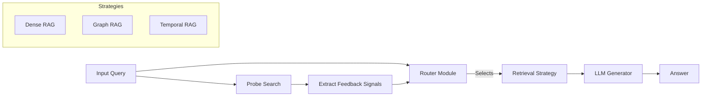

# RAQR System Architecture

## 1. High-Level Design
The system is designed as a **modular pipeline** rather than an autonomous agentic swarm. It separates **Data Preparation** (Offline) from **Routing & Inference** (Online/Test).

The architecture follows a strict **Interface-Based Design**: all Retrieval Strategies must implement a common `retrieve_and_generate` interface, and all Routers must implement a common `predict_route` interface.

For rigorous evaluation, strategies do **not** return only a string. They return a small structured object (e.g., `StrategyResult`) containing:

- `answer: str`
- `contexts: list[DocumentChunk]` (or IDs/references)
- `scores: list[float]` (aligned with `contexts`)
- `latency_ms: dict` (at minimum: `retrieval`, `generation`, `total`)

### System Diagram (Conceptual)


## 2. Technology Stack

Nice — here’s a clean, coordinator-friendly replacement **“Core Runtime”** section you can paste directly into your document.

It reflects:

* **Poetry** for reproducible environments with minimal setup friction
* **Simple configuration (+ optional dotenv)**
* Python 3.10+
* Easy “one-command” execution for assessors

### Core Runtime

#### Language

* **Python 3.10+**

#### Environment Management

* **Poetry** is used for dependency management and virtual environment isolation.
* All dependencies are strictly pinned via `poetry.lock` to ensure reproducible installs across machines.
* Poetry automatically manages the virtual environment; no manual `venv` activation is required.

**Installation and setup:**

```bash
# Install dependencies
poetry install
```

**Running tests:**

```bash
poetry run pytest
```

**Running the application / demo:**

```bash
poetry run python -m <project_module>
```

> This workflow minimizes setup friction for external evaluators while maintaining reproducibility.

#### Configuration

* Configuration is handled using simple configuration files (e.g., YAML or TOML) stored in the repository.
* Environment-specific or sensitive values (e.g., API keys) may be provided via a `.env` file loaded at runtime.
* A template file (`.env.example`) is included to document required variables.

This approach keeps the project easy to run for assessors while remaining flexible for experimentation and testing.

### Data & Retrieval
*   **Vector Store:** `FAISS` (CPU version suffices for this scale)
*   **Graph Engine:** `NetworkX` (in-memory) for lightweight GraphRAG implementation.
*   **Embeddings:** `HuggingFace Embeddings` (Model: `all-MiniLM-L6-v2` for speed/standardisation).

### Machine Learning & Routers
*   **Deep Learning Framework:** `PyTorch` (v2.0+).
*   **Transformer Library:** `Hugging Face Transformers` (for loading/fine-tuning DistilBERT).
*   **Classical ML:** `Scikit-Learn` (for metrics, skewness calc, SVM baselines if needed).

### LLM Interface
*   **Orchestration:** `LangChain` (Core primitives only) or raw API calls.
*   **Inference:**
    *   **Production:** OpenAI API (`gpt-4o-mini`).
    *   **Local (Optional):** `Ollama` running `Llama-3-8B`.

## 3. Module Specifications

### A. The Data Pipeline (`src/data`)
Responsible for ingesting datasets and normalizing them into a standard schema.

*   **Input Formats:** NQ (JSONL), ComplexTempQA (JSON), WikiWhy (CSV).
*   **Unified Schema (`corpus.jsonl`):**
    ```json
    {
      "id": "uuid",
      "text": "Full document text...",
      "metadata": {"date": "2023-01-01", "source": "wiki", "title": "..."}
    }
    ```
*   **Evaluation Schema (`benchmark.jsonl`):**
    ```json
    {
      "question_id": "uuid",
      "question": "Who was...",
      "gold_answer": "Expected string",
      "gold_strategy": "Dense_RAG" // Populated by Oracle (Dense_RAG | Graph_RAG | Temporal_RAG)
    }
    ```

### B. The Retrieval Strategies (`src/strategies`)
Each strategy class inherits from `BaseStrategy`. There are **3** concrete implementations.

1.  **`DenseStrategy`:** Standard LangChain `VectorStoreRetriever`.
2.  **`GraphStrategy`:** Entity extraction (spaCy; optionally GLiNER) $\rightarrow$ `NetworkX` neighbor lookup.
3.  **`TemporalStrategy`:** Date extraction (Regex/LLM) $\rightarrow$ FAISS vector search + explicit post-filter by `year` metadata (refill from deeper ranks until \(k\) contexts).

### C. The Probe Module (`src/probe`)
Runs *before* the router. It executes a low-latency search (Dense RAG top-k=10).

*   **Output Object:**
    ```python
    @dataclass
    class ProbeSignals:
        max_score: float       # Top result cosine similarity
        min_score: float       # 10th result score
        mean_score: float      # Average of top 10
        skewness: float        # scipy.stats.skew(scores)
        semantic_dist: float   # Avg distance query<->centroid
    ```

### D. The Router Modules (`src/routers`)

#### 1. Heuristic Router (`heuristic.py`)
*   **Logic:** Hardcoded Python functions.
*   **Config:** Uses a `yaml` file for thresholds (e.g., `skew_threshold: 0.5`).

#### 2. Classifier Router (`classifier.py`)
*   **Architecture:** DistilBERT model with a modified Classification Head.
*   **Inputs:**
    *   Tokens (Text) $\rightarrow$ Transformer Layers $\rightarrow$ `[CLS]` embedding.
    *   Signals (Floats) $\rightarrow$ Normalized $\rightarrow$ Concatenated with `[CLS]`.
    *   Output $\rightarrow$ Linear Layer $\rightarrow$ Softmax (3 classes).

#### 3. LLM Router (`llm.py`)
*   **Logic:** Jinja2 prompt template populated with Question + Probe Stats.
*   **Output Parser:** Regex to extract strategy name from LLM response.

## 4. The Experiment Workflow

The codebase is organized to run in **4 sequential stages**:

### Stage 1: Ingestion (Data Prep)
*   **Script:** `python scripts/01_ingest_data.py`
*   **Action:** Downloads raw datasets, chunks text, builds FAISS index, builds Graph structures.
*   **Artifacts:** `data/processed/vector_index.faiss`, `data/processed/graph.pkl`.

### Stage 2: Oracle Label Generation (The "Ground Truth")
*   **Script:** `python scripts/02_run_oracle.py`
*   **Action:**
    1.  Loops through the Benchmark Dataset.
    2.  Runs **ALL 3** strategies for every question.
    3.  Evaluates answers using `F1 Score` vs Gold Answer.
    4.  Selects the winner using a **margin-based simplicity bias** rule (\(\delta\)) with deterministic tie-break: **Dense > Temporal > Graph**.
*   **Artifacts:** `data/training/labeled_dataset.jsonl` (This is your training data).

### Stage 3: Training (Classifier Only)
*   **Script:** `python scripts/03_train_router.py`
*   **Action:** Loads `labeled_dataset.jsonl`. Fine-tunes the DistilBERT model.
*   **Artifacts:** `models/classifier_router.pt`.

### Stage 4: Evaluation (The Ablation Run)
*   **Script:** `python scripts/04_evaluate.py --config configs/ablation_v1.yaml`
*   **Action:**
    1.  Loads the Test Set.
    2.  Instantiates the specific Router (Heuristic/Classifier/LLM) based on config.
    3.  Predicts route.
    4.  Executes selected strategy.
    5.  Logs metrics (Routing Accuracy, Final F1, Latency).
*   **Artifacts:** `results/experiment_results.csv`.

## 5. Development Standards
*   **Docstrings:** Google Style Python Docstrings.
*   **Typing:** Strict Type Hinting (`typing.List`, `typing.Optional`) for all function signatures.
*   **Logging:** Use Python `logging` module (not print statements) to capture experimental data.
*   **Reproducibility:** Seed everything. `torch.manual_seed(42)`, `np.random.seed(42)`.