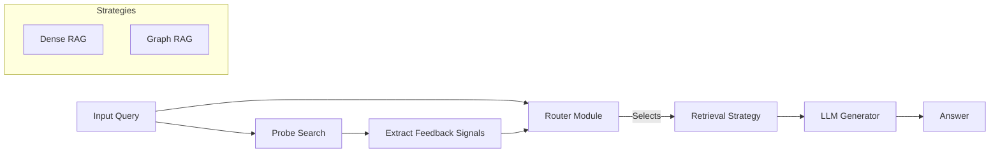

# RAQR System Architecture

## 1. High-Level Design

The system is designed as a **modular pipeline** rather than an autonomous agentic swarm. It separates **Data Preparation** (Offline) from **Routing & Inference** (Online/Test).

The architecture follows a strict **Interface-Based Design**: all Retrieval Strategies must implement a common `retrieve_and_generate` interface, and all Routers must implement a common `predict_route` interface.

For rigorous evaluation, strategies do **not** return only a string. They return a small structured object (e.g., `StrategyResult`) containing:

- `answer: str`
- `context_scores: List[Tuple[str, float]]` (context text, score pairs)
- `latency_ms: dict` (at minimum: `retrieval`, `generation`, `total`)

### System Diagram (Conceptual)


```mermaid
graph LR
    User[Input Query] --> Probe[Probe Search]
    Probe --> Stats[Extract Feedback Signals]
    User --> Router[Router Module]
    Stats --> Router

    Router -->|Selects| Strategy[Retrieval Strategy]

    subgraph Strategies
    S1[Dense RAG]
    S2[Graph RAG]
    end

    Strategy --> Generator[LLM Generator]
    Generator --> Answer
```

## 2. Technology Stack

Nice — here’s a clean, coordinator-friendly replacement **“Core Runtime”** section you can paste directly into your document.

It reflects:

- **Poetry** for reproducible environments with minimal setup friction
- **Simple configuration (+ optional dotenv)**
- Python 3.10+
- Easy “one-command” execution for assessors

### Core Runtime

#### Language

- **Python 3.10+**

#### Environment Management

- **Poetry** is used for dependency management and virtual environment isolation.
- All dependencies are strictly pinned via `poetry.lock` to ensure reproducible installs across machines.
- Poetry automatically manages the virtual environment; no manual `venv` activation is required.

**Installation and setup:**

```bash
# Install dependencies
poetry install
```

**Running tests:**

```bash
poetry run pytest
```

**Running the application / demo:**

```bash
poetry run python -m <project_module>
```

> This workflow minimizes setup friction for external evaluators while maintaining reproducibility.

#### Configuration

- Configuration is handled using simple configuration files (e.g., YAML or TOML) stored in the repository.
- Environment-specific or sensitive values (e.g., API keys) may be provided via a `.env` file loaded at runtime.
- A `.env` file may be used locally to document required variables.

This approach keeps the project easy to run for assessors while remaining flexible for experimentation and testing.

### Data & Retrieval

- **Vector Store:** `FAISS` (CPU version suffices for this scale)
- **Graph Engine:** `NetworkX` (in-memory) for relation-aware GraphRAG (triple traversal + provenance).
- **Embeddings:** `HuggingFace Embeddings` (Model: `all-MiniLM-L6-v2` for speed/standardisation).

### Machine Learning & Routers

- **Deep Learning Framework:** `PyTorch` (v2.0+).
- **Transformer Library:** `Hugging Face Transformers` (for loading/fine-tuning DistilBERT).
- **Entity & Relation Extraction:** LLM (OpenAI) one-pass extraction via Batch API.
- **Classical ML:** `Scikit-Learn` (for metrics, skewness calc, SVM baselines if needed).

### LLM Interface

- **Orchestration:** `LangChain` (Core primitives only) or raw API calls.
- **Inference:**
    - **Production:** OpenAI API (`gpt-4o-mini`).
    - **Local (Optional):** `Ollama` running `Llama-3-8B`.

## 3. Module Specifications

### A. The Data Pipeline (`src/data`)

Responsible for ingesting datasets and normalizing them into a standard schema.

- **Input Formats:** NQ (JSONL), 2WikiMultiHopQA (JSONL)
- **Unified Corpus Schema (`corpus.jsonl`) (chunk-level):**
    - The authoritative definition is in `docs/Corpus Creation Strategy.md`.
    - `corpus.jsonl` is a **chunk inventory** shared by all strategies (Dense/Graph).
    ```json
    {
        "chunk_id": "uuid",
        "doc_id": "uuid",
        "source": "wikipedia|nq|2wiki",
        "title": "string|null",
        "url": "string|null",
        "text": "string",
        "section_path": ["Lead", "Early life", "Career"],
        "char_span_in_doc": [1234, 1876],
        "metadata": {
            "dataset_origin": "nq|2wiki",
            "page_id": "string|null",
            "revision_id": "string|null",
            "years": [1998, 2001],
            "year_min": 1998,
            "year_max": 2001,
            "entities": [
                {
                    "surface": "United States",
                    "norm": "united states",
                    "type": "GPE",
                    "qid": "Q30"
                }
            ],
            "relations": [
                {
                    "subj_norm": "barack obama",
                    "pred": "born_in",
                    "obj_norm": "united states"
                }
            ],
            "anchors": {
                "outgoing_titles": ["France", "2012 Summer Olympics"],
                "incoming_stub": []
            }
        }
    }
    ```
- **Evaluation Schema (`benchmark.jsonl`) (Phase 1 output):**

    ```json
    {
        "question_id": "uuid",
        "question": "Who was...",
        "gold_answers": ["Expected string 1", "Expected string 2"],
        "dataset_source": "nq|2wiki"
    }
    ```

    > Note: `benchmark.jsonl` intentionally does **not** include `gold_strategy` in Phase 1; strategy labels are added only by the Oracle in Phase 3.

- **Oracle-Labeled Schema (`labeled_{train,dev}.jsonl`) (Phase 3 output):**
    ```json
    {
        "question_id": "uuid",
        "question": "Who was...",
        "gold_answers": ["Expected string 1", "Expected string 2"],
        "dataset_source": "nq|2wiki",
        "split": "train|dev",
        "gold_strategy": "Dense_RAG|Graph_RAG" // Populated by Oracle
    }
    ```

### B. The Retrieval Strategies (`src/raqr/strategies`)

Each strategy class inherits from `BaseStrategy`. There are **3** concrete implementations.

1.  **`DenseStrategy`:** Custom FAISS indexing (`FaissIndexStore`) + `SentenceTransformersEmbedder`; maps row IDs to chunk texts via `vector_meta.parquet`.
2.  **`GraphStrategy`:** Relation-aware traversal using **predicate edges** (Subject-Predicate-Object triples) and **provenance edges** (Entity $\rightarrow$ Chunk). Query entity extraction uses an **LLM call** (default) to extract entities from the question; optionally **vector similarity** against an entity index bridges alternate phrasings (e.g. "Einstein" $\rightarrow$ "Albert Einstein"). NetworkX triple traversal (1-hop) resolves evidence chunks via provenance edges. Candidate hop and path relevance scoring is managed via a configurable `ScoringConfig` (`local_pred_weight`, `bundle_pred_weight`, `length_penalty`).

### C. The Probe Module (`src/probe`)

Runs _before_ the router. It executes a low-latency search (Dense RAG top-k=10).

- **Output Object:**
    ```python
    @dataclass
    class ProbeSignals:
        max_score: float       # Top result cosine similarity
        min_score: float       # 10th result score
        mean_score: float      # Average of top 10
        skewness: float        # scipy.stats.skew(scores)
        semantic_dispersion: float   # Avg distance query<->centroid (alias: semantic distance)
    ```

### D. The Router Modules (`src/routers`)

#### 1. Heuristic Router (`heuristic.py`)

- **Logic:** Hardcoded Python functions.
- **Config:** Uses a `yaml` file for thresholds (e.g., `skew_threshold: 0.5`).

#### 2. Classifier Router (`classifier.py`)

- **Architecture:** MLP Classification Head with dynamic input dimension.
- **Inputs:**
    - Q-Emb: Pre-computed `all-MiniLM-L6-v2` embedding (384 dims).
    - Signals (Floats) → Z-score Normalized → Concatenated with Q-Emb.
    - Output → Linear Layer → Softmax (2 classes: Dense, Graph).

#### 3. LLM Router (`llm.py`)

- **Logic:** Jinja2 prompt template populated with Question + Probe Stats.
- **Output Parser:** Regex to extract strategy name from LLM response.

## 4. The Experiment Workflow

The codebase is organized to run in **4 sequential stages**:

### Stage 1: Ingestion (Data Prep)

- **Scripts:** `python scripts/01_ingest_data.py` and `python scripts/01_build_corpus.py`
- **Action:** Build the benchmark, then build the unified chunked corpus (plus enrichment) and retrieval artifacts (FAISS + metadata table + NetworkX graph), per `docs/Corpus Creation Strategy.md`. Train/dev/test splits for the router are applied later when building `labeled_*.jsonl`.
- **Artifacts:** `data/processed/corpus.jsonl`, `data/processed/vector_index.faiss`, `data/processed/vector_meta.parquet`, `data/processed/graph.pkl` (and optional docstore).

### Stage 2: Oracle Label Generation (The "Ground Truth")

- **Script:** `python scripts/02_run_oracle.py`
- **Action:**
    1.  Loops through the Benchmark Dataset.
    2.  Runs **ALL 3** strategies for every question.
    3.  Evaluates answers using **LLM-as-judge** for semantic correctness.
    4.  Selects the winner using a **margin-based simplicity bias** rule (\(\delta\)) with deterministic tie-break: **Dense > Graph**.
- **Artifacts:** `data/training/labeled_train.jsonl`, `data/training/labeled_dev.jsonl` (This is your training data).

### Stage 3: Training (Classifier Only)

- **Script:** `python scripts/03_train_router.py`
- **Action:** Loads `labeled_train.jsonl` / `labeled_dev.jsonl`. Fine-tunes the DistilBERT model.
- **Artifacts:** `models/classifier_router.pt`.

### Stage 4: Evaluation (The Ablation Run)

- **Script:** `python scripts/04_evaluate.py --config configs/ablation_v1.yaml`
- **Action:**
    1.  Loads the Test Set.
    2.  Instantiates the specific Router (Heuristic/Classifier/LLM) based on config.
    3.  Predicts route.
    4.  Executes selected strategy.
    5.  Logs metrics (Routing Accuracy, Final F1, Latency).
- **Artifacts:** `results/experiment_results.csv`.

## 5. Development Standards

- **Docstrings:** Google Style Python Docstrings.
- **Typing:** Strict Type Hinting (`typing.List`, `typing.Optional`) for all function signatures.
- **Logging:** Use Python `logging` module (not print statements) to capture experimental data.
- **Reproducibility:** Seed everything. `torch.manual_seed(42)`, `np.random.seed(42)`.
